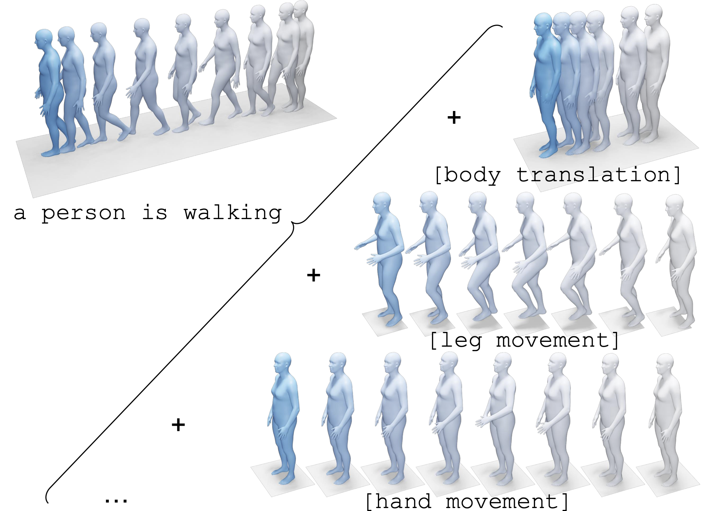

# Language-guided Human Motion Synthesis with Atomic Actions




> **Language-guided Human Motion Synthesis with Atomic Actions**
>
> [Yuanhao Zhai](https://www.yhzhai.com), [Mingzhen Huang](https://mingzhenhuang.com), [Tianyu Luan](https://tyluann.github.io), [Lu Dong](https://dongludeeplearning.github.io), [Ifeoma Nwogu](https://cubs.buffalo.edu/~inwogu/index.html), [Siwei Lyu](https://cse.buffalo.edu/~siweilyu/), [David Doermann](https://cse.buffalo.edu/~doermann/), and [Junsong Yuan](https://cse.buffalo.edu/~jsyuan/)
>
> University at Buffalo
>
> ACM MM 2023
>

This repo contains the our PyTorch implementation on the text-to-motion synthesis task.

## 1. Environment setup

Install ffmpeg
```shell
sudo apt update
sudo apt install ffmpeg
```

Setup conda environment
```shell
pip install -r requirements.txt
python -m spacy download en_core_web_sm
```

Download dependency for text-to-motion synthesis
```shell
bash prepare/download_smpl_files.sh
bash prepare/download_glove.sh
bash prepare/download_t2m_evaluators.sh
```


## 2. Dataset preparation

Please follow [MDM](https://github.com/GuyTevet/motion-diffusion-model#2-get-data) to setup the dataset.

## 3. Training

For training on the HumanML3D dataset, run the following command.
```shell
python -m train.train_cvae --save_dir save/humanml --overwrite --dataset humanml --eval_during_training --kld_w 1e-2 --att_spa_w 1e-2 --codebook_norm_w 1e-2 --mask_ratio 0.5 --mask_sched linear
```

For the KIT dataset, add `--dataset kit` flag. Please also change the save_dir accordingly.

Besides, we also provide option to use better CLIP encoder by adding `--use_transformers_clip` flag, which potentially gives better performance.

## 4. Evaluation


We provide our pretrain checkpoint [here](https://buffalo.box.com/s/s08f6njh3vef8jepuevqept31pvtcnl5). To reproduce our result, run the following command.
For HumanML3D:
```shell
python -m eval.eval_humanml_cvae --model_path {path-to-humanml-pretrained-model} --dataset humanml --eval_mode mm_short
```
For KIT:
```shell
python -m eval.eval_humanml_cvae --model_path {path-to-kit-pretrained-model} --dataset kit --num_code 512 --eval_mode mm_short
```

## 5. Text-to-motion synthesis

Run the following command to generate a motion given a text prompt. The output contains stick figure animation for the generated motion, and a .npy file containing the xyz coordinates of the joints.

```shell
python -m sample.generate_cvae --modal_path {checkpoint-path} --text_prompt {text prompt}
```

## 6. Rendering
Use the following command to create the .obj SMPL mesh file.
```shell
python -m visualize.render_mesh --input_path {path-to-mp4-stick-animation-file}
```

We also provide a Blender script in `render/render.blend` to render the generated SMPL mesh.


## Citation
If you find our project helpful, please cite our work
```bibtex
@inproceedings{zhai2023language,
  title={Language-guided Human Motion Synthesis with Atomic Actions},
  author={Zhai, Yuanhao and Huang, Mingzhen and Luan, Tianyu and Dong, Lu and Nwogu, Ifeoma and Lyu, Siwei and Doermann, David and Yuan, Junsong},
  booktitle={Proceedings of the 31st ACM International Conference on Multimedia},
  pages={5262--5271},
  year={2023}
}
```

## Acknowledgement

This project is developed upon [MDM: Human Motion Diffusion Models](https://guytevet.github.io/mdm-page/), thanks to their great work!
